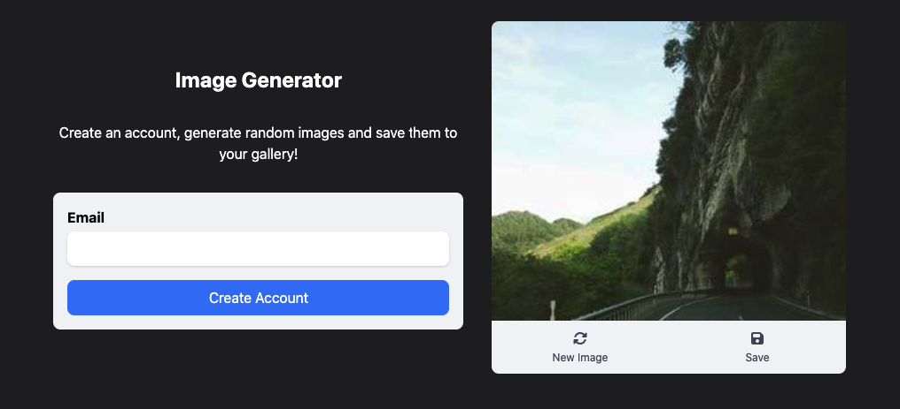

# Image generator

Create email accounts, generate random images and add them to your gallery!



## Demo

Here is a working live demo: https://kapaha.github.io/netmatters-array-reflection/

## Tech Stack

-   HTML
-   Tailwind CSS

## Setup & Installation

1. Clone the repository

    ```bash
    git clone git@github.com:kapaha/netmatters-array-reflection.git
    cd netmatters-array-reflection
    ```

2. Install dev dependencies

    ```bash
    npm ci
    ```

3. Run the development server
    ```bash
    npm run dev
    ```
